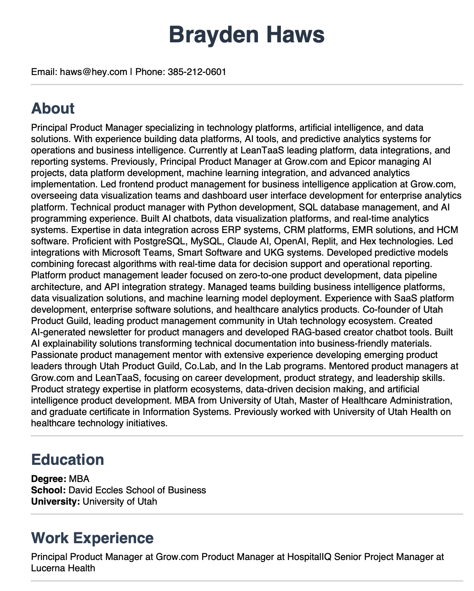

# Django Resume Generator

#### Current status: Complete

___

### Personal Progress
* **What I learned**: How to generate and download PDFs from HTML using Django templates and ReportLab
* **What I wish I had done differently**: Added more styling and field options to the resume, rather than just following the course recommendations
* **What I am most proud of**: Completing this project in about an hour of time and finding an alternative path to PDF generation since the course option relied on system-level dependencies and I 
  wanted this to work in isolation
* **What I want to learn next**: Keep working through the course, and continuing to build Django and fullstack development skills

## Description
This is a resume generator application built as a project in the [Python and Django Framework Complete Course](https://www.udemy.com/course/django-course/). The application allows users to create professional resumes by entering their information through a web form and downloading them as styled PDF documents. The project demonstrates Django fundamentals, form handling, and PDF generation using ReportLab.

## Features

- **Resume Form**: Web form for entering personal information, education, work experience, and skills
- **Profile Management**: Store and manage multiple resume profiles in the database
- **PDF Generation**: Generate professionally formatted PDF resumes using ReportLab
- **Custom Styling**: Enhanced PDF styling with custom fonts, colors, and spacing for polished output
- **Download Functionality**: Download generated resumes as PDF files with proper filenames
- **Admin Panel**: Django admin interface for managing profiles

## Technical Stack

**Framework & Core Technologies**:
- **Django 6.0**: Full-stack web framework
- **SQLite**: Database for profile storage
- **Python 3.13**: Backend programming language

**PDF Generation**:
- **ReportLab**: Python library for PDF creation (system-independent alternative to wkhtmltopdf)

**Key Features Implemented**:
- Function-based views for form handling and PDF generation
- Template rendering with Bootstrap styling
- Custom PDF styling with ReportLab's paragraph styles and flowables
- File download responses with proper content headers

## Application Structure

The project consists of a single Django app called `pdf` that handles all resume functionality:

**Models** (`pdf/models.py:5-19`):
- `Profile`: Stores resume information including name, email, phone, about, degree, school, university, previous_work, and skills

**Views** (`pdf/views.py:12-116`):
- `accept`: Handles form submission and profile creation
- `resume`: Generates and downloads PDF resume for a specific profile
- `profile_list`: Displays all saved profiles

**Key Implementation Details**:

**PDF Generation** (`pdf/views.py:31-112`):
Uses ReportLab's SimpleDocTemplate to create professionally formatted PDFs with custom styling:
- Custom title and heading styles with specific fonts and colors
- Horizontal rules to separate sections
- Proper spacing and layout using Spacer and inch measurements
- Dynamic content rendering based on profile data

**Form Processing** (`pdf/views.py:14-26`):
Collects form data from POST request and creates Profile instances in the database.

## License

This project is a learning exercise and is available for reference under the [MIT License](LICENSE).